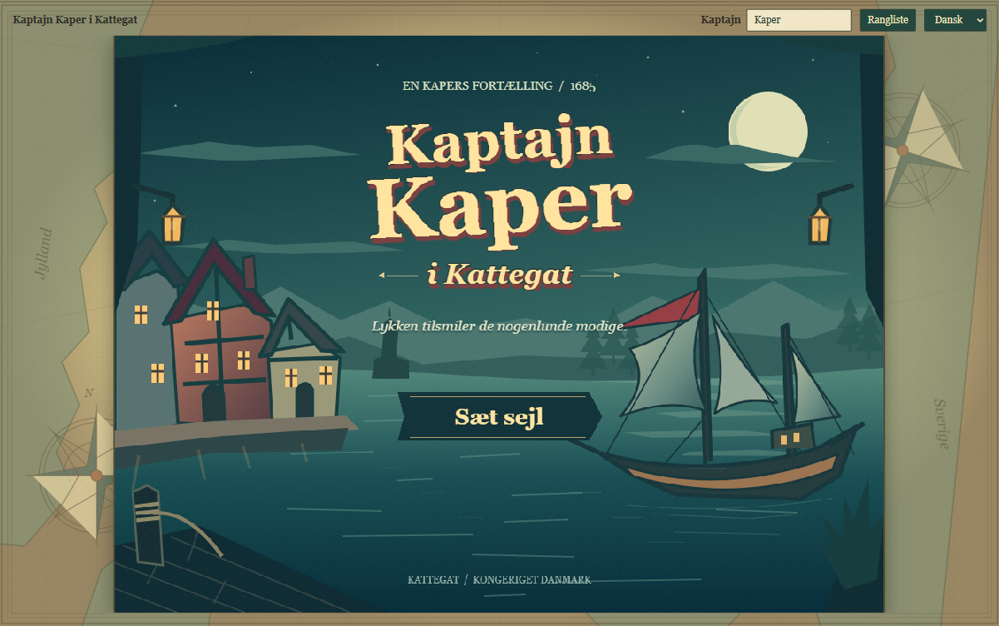
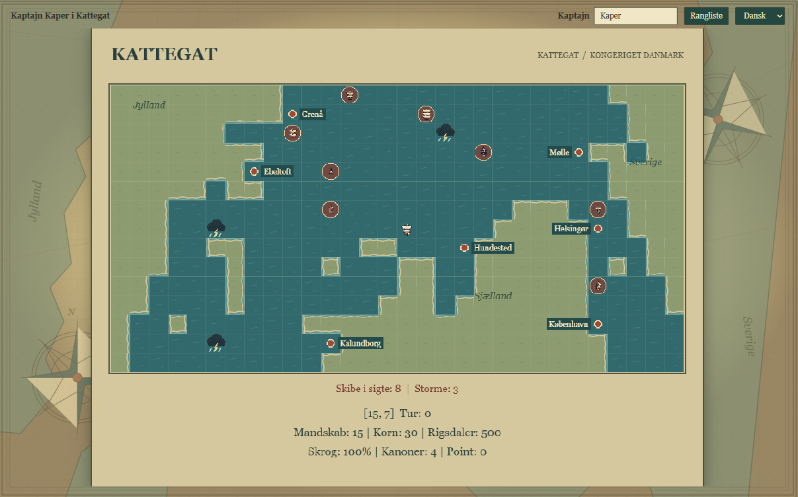

# Kaptajn Kaper i Kattegat

A playable, work-in-progress web remake of Peter Ole Frederiksen's 1985 Danish privateer game. Built with Phaser 3, TypeScript, and Vite, with a Node.js/SQLite leaderboard.

## Screenshots





## Project Status

The core sailing, trading, combat, and leaderboard flows are implemented. This is a playable prototype, not a finished or fully faithful recreation of the original game.

| Area | Current implementation |
| --- | --- |
| Presentation | Illustrated title screen, antique-chart surround, animated ship sprites and damage states, scaled 1024x768 game canvas |
| Languages | Danish and English, switchable during play |
| Navigation | 30x15 Kattegat map, coastline collision, seven harbors, eight-direction keyboard movement |
| Sea encounters | Eight enemy ship types and moving storms; contacts advance on sailing turns, enemies chase nearby players, storms damage the hull |
| Harbors | Entry or decline, trading, crew hiring, ship repairs, quantity input, and return to the previous sea position |
| Cannon combat | Interactive bearing/elevation aim, wind and range correction, shot feedback, reload lock, closing range, and retreat |
| Difficulty assistance | Easy/normal starts with calibrated aim and gets stronger player shots and reduced return fire; the sight shows predicted on-target shots |
| Boarding | Merchant boarding and close-range/damaged-ship boarding, assault/guard/withdraw choices, persistent casualties, capture rewards |
| Player and scores | Player name, game-over score submission, top-20 leaderboard stored in SQLite, duplicate-run protection |
| Deployment | Docker development stack and production container serving the game and API |

New games currently start with **15 crew, 30 grain, 500 rigsdaler, four cannons, and 100 hull**, at difficulty `1`. These live defaults are defined in [src/game/GameState.ts](src/game/GameState.ts), not the historical values in the extracted data notes.

## Run With Docker

Install Docker with Compose support; on Windows, start Docker Desktop first.

### Development

```bash
docker compose up -d --build
```

Open http://localhost:5173. Vite reloads source changes automatically, and proxies leaderboard requests to the API container.

```bash
docker compose down
```

Scores persist in the `leaderboard-data` Docker volume. Do not use `down -v` unless you intend to delete that data.

### Production

```bash
docker compose -f docker-compose.prod.yml up -d --build
```

Open http://localhost:8080. The production container serves both the built frontend and the SQLite API using Node.js 24. It also persists scores in a Docker volume.

The leaderboard requires a running API and persistent database storage. Uploading only the static build to GitHub Pages does not provide a working leaderboard. Internet-facing deployments also need HTTPS and appropriate abuse controls.

## Development Checks

With the development containers running:

```bash
docker compose exec -T kaptajn-kaper-dev npx tsx --test scripts/localization.test.ts scripts/map.test.ts scripts/sea-encounters.test.ts scripts/interactive-combat.test.ts
docker compose exec -T -e NODE_OPTIONS=--max-old-space-size=3072 kaptajn-kaper-dev npm run build
```

The build writes to `dist/`. Phaser can produce a large-bundle warning. A successful Vite build does not mean the separate TypeScript check passed.

The API tests require Node.js 24 for native SQLite. From the project root, Docker can run them against temporary test databases:

```bash
docker run --rm --mount "type=bind,source=.,target=/app,readonly" -w /app node:24-alpine node --test server/server.test.mjs
```

[scripts/](scripts/) also contains browser regression checks for trading quantities, harbor return, sea encounters, battle graphics, interactive combat, and leaderboard behavior. They run inside the live application; they are not a single automated end-to-end test command.

Repository-wide `npm run type-check` and `npm run lint` are available as scripts, but are not currently established as clean release gates. Known type-check issues remain, and the lint script has no checked-in ESLint configuration.

## Project Layout

| Location | Purpose |
| --- | --- |
| [src/main.ts](src/main.ts) | Phaser configuration and scene registration |
| [src/scenes/](src/scenes/) | Title, story, sailing, harbor, trading, battle, boarding, and game-over screens |
| [src/game/](src/game/) | Game state, combat, trading, and sea encounter rules |
| [src/data/](src/data/) | Map, enemy, story, and economy data |
| [src/i18n.ts](src/i18n.ts) and [src/locales.ts](src/locales.ts) | Language selection and Danish/English strings |
| [public/assets/](public/assets/) | Runtime artwork, sprite atlases, and tilesets |
| [server/](server/) | HTTP API, SQLite storage, and API tests |
| [scripts/](scripts/) | Regression checks and boarding asset generator |
| [tools/](tools/) | PowerShell sprite generators |
| [original-source/](original-source/) | Preserved BASIC source and original title data |

The live map is generated from [src/data/map.json](src/data/map.json). Legacy TMJ files remain in the repository but are not the active map source. Some asset sources are duplicated under [assets/](assets/) for the generation workflow.

## Remaining Work

- Sound effects and music.
- Complete touch navigation and trading controls. Some actions support pointer input and the canvas scales to mobile, but a keyboard is still needed for the full game.
- Save/resume for an active voyage. Stored names and leaderboard scores are not saved games.
- Original-game prize crews and captured-ship delivery, crew disease events, and a harbor steering minigame.
- Further combat and economy balancing, especially boarding with a small starting crew.
- Clean repository-wide type-check/lint gates and a unified browser test runner.
- Leaderboard anti-cheat and rate limiting. Input validation, prepared SQL statements, request-size limits, and origin checks are implemented, but scores are still reported by the client and are not authoritative.

## Source Notes And License

[DATA_EXTRACTION.md](DATA_EXTRACTION.md) and [original-source/README.md](original-source/README.md) preserve extraction and source notes. They describe historical data and early implementation assumptions, not necessarily the current gameplay rules. The BASIC source remains the reference for original behavior.

The repository's [LICENSE](LICENSE) contains **GNU GPL version 3**. [package.json](package.json) currently declares `MIT`; this licensing metadata mismatch needs clarification before describing the remake as MIT-licensed. This README does not change either license file or package metadata.

Original game: Peter Ole Frederiksen (1985). Source preservation: Det Kgl. Bibliotek (Royal Danish Library), via Thorbjørn Stegelmann.
